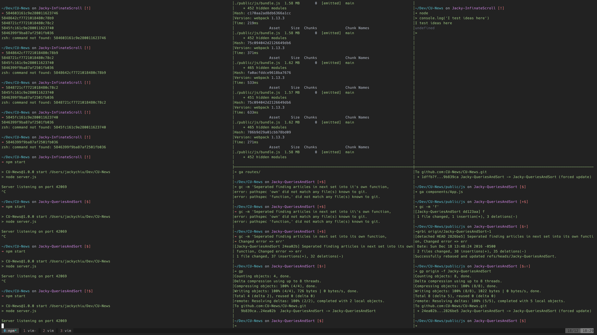
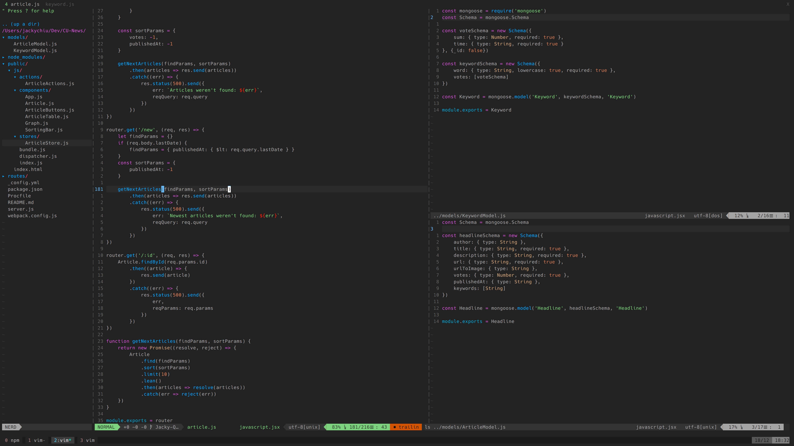

## JackyChiu's dotfiles
My dotfiles used for my workflow with tmux+vim <br/>
*Disclamer: Most configs were found online and I picked whichever I found useful*

## Installing
If you want to checkout my enviroment you can use my setup script or manually copy paste all the dotfiles into your `~` dir
```bash 
git clone https://github.com/JackyChiu/dotfiles.git
cd dotfiles
./setup.sh
```

If you don't have Vundle for vim installed in your `.vim` dir
```bash
git clone https://github.com/VundleVim/Vundle.vim.git ~/.vim/bundle/Vundle.vim
```

Install plugins for vim
```bash
vim ~/.vimrc
:PluginInstall
```

*Side note: Mouse seting commands for .tmux.conf only work with tmux 2.1 +*

## Extra info
- Using Oh My Zsh in iTerm2
- Zsh theme: Spaceship, https://github.com/denysdovhan/spaceship-zsh-theme
- Terminal theme: Atom One Dark, https://github.com/nathanbuchar/atom-one-dark-terminal
- Vim theme: Atom One Dark, https://github.com/joshdick/onedark.vim

## Tmux Panes


## Vim Windows


(Image updated on 2016-12-18) 
