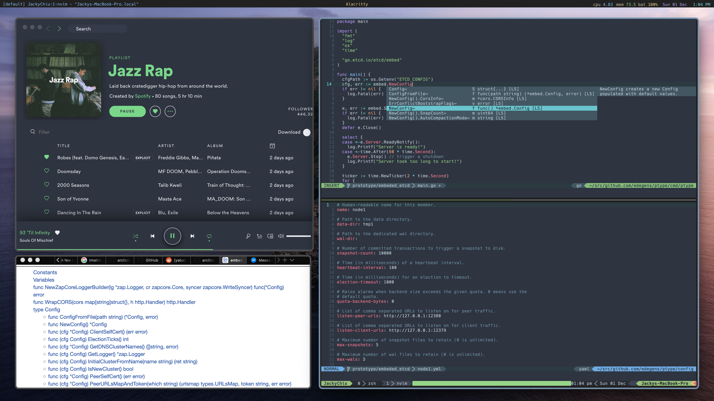

## JackyChiu's dotfiles
My beloved dotfiles, for development and window management 😊

## Result


## Installing
I have a handly setup.sh script ready for installation, but you probably don't want all my files so go into the script and modify the line that defines the dotfiles to install
```bash 
git clone https://github.com/JackyChiu/dotfiles.git
cd dotfiles

# Links dotfiles to home dir and setups some dirs
./setup.sh
```

### Vim Setup
```bash
# vim-plug install
curl -fLo ~/.vim/autoload/plug.vim --create-dirs \
    https://raw.githubusercontent.com/junegunn/vim-plug/master/plug.vim

# vim plugin install
vim ~/.vimrc
:PlugInstall
```

### Tmux Setup

```bash
# reattach-to-user-namespace
brew install reattach-to-user-namespace

# tpm (tmux package manager)
git clone https://github.com/tmux-plugins/tpm ~/.tmux/plugins/tpm
```

*Side note: Mouse seting commands for .tmux.conf only work with tmux 2.1 +*

## Development Workflow:
- vim
- tmux

## Window Managment: 
- [kwm](https://github.com/koekeishiya/kwm)
- [khd](https://github.com/koekeishiya/khd)
- [Ubersicth](http://tracesof.net/uebersicht/)

## Extra info
- Using Oh My Zsh in iTerm2
- Zsh theme: [Spaceship](https://github.com/denysdovhan/spaceship-zsh-theme)
- Terminal theme: [Atom One Dark](https://github.com/joshdick/onedark.vim)
- Vim theme: [Atom One Dark](https://github.com/joshdick/onedark.vim)
- Lightline theme: [Atom One Dark](https://github.com/joshdick/onedark.vim)
- Nerbar theme: [Atom One Dark](https://github.com/JackyChiu/nerdbar.widget)

